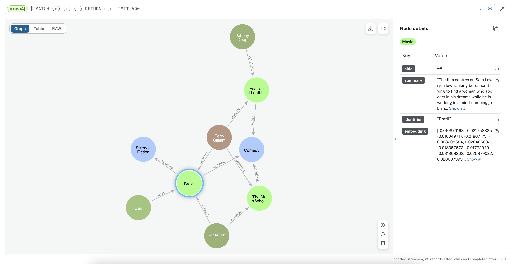

# Concerto Graph

This project uses a [Concerto model](https://concerto.accordproject.org) to define the nodes and edges in a Neo4J graph database and uses the model to validate the properties on the nodes.


[Demo](src/demo/index.ts)

In a few lines of code you can define a Concerto data model validated graph and perform a vector similarity search over
nodes with text content.

Concerto model (snippet):

```
concept Movie extends GraphNode {
  @vector_index("summary", 1536, "COSINE")
  o Double[] embedding optional
  @embedding
  o String summary optional
  @label("IN_GENRE")
  --> Genre[] genres optional
}
```

## Graph Model

The data model for the graph (the definition of the structure of the nodes and edges) is specified
using a [Concerto model](https://concerto.accordproject.org). The nodes in the graph should extend
`GraphNode`. 

Here is a very simple sample model for books: each book is related to a Genre. A book has a
`summary` property that is full-text searchable as well as searchable using a vector
similarity search.

```
@description("Ask questions about books and book genres.")
namespace test@1.0.0
import org.accordproject.graph@1.0.0.{GraphNode}

@questions("How many books genres do we have?")
concept Genre extends GraphNode {
}

@questions("How many books do we have?", 
"Find a book about the theme of natural disasters", 
"Find a book containing the phrase 'Disaster Capitalism'")
concept Book extends GraphNode {
  o Double[] embedding optional
  @vector_index("embedding", 1536, "COSINE")
  @fulltext_index
  o String summary optional
  @label("IN_GENRE")
  --> Genre[] genres optional
}
```

### Decorators

1. `@description` is placed on the namespace and describes the general types of questions that can be asked of this model
2. `@vector_index` is placed on `String` properties to make them vector similarity searchable. The first argument to the decorator specifies the name of a property of type `Double[]` that is used to store the vector embeddings for the text in the `String` property
3. `@fulltext_index` is placed on `String` properties to make them fulltext searchable
4. `@label` is placed on relationships `-->` to indicate the type of an edge
5. `@questions` is placed on concepts that extend `GraphNode` to supply sample questions that can be asked about this type of node

## Install

```bash
npm i @accordproject/concerto-graph@unstable --save
```

> Note you may want to pin to a specific version, however this package is currently changing frequently.

## Adding Nodes and Edges to the Graph

```typescript
    await graphModel.mergeNode(transaction, `${NS}.Movie`, {identifier: 'Brazil', summary: 'The film centres on Sam Lowry, a low-ranking bureaucrat trying to find a woman who appears in his dreams while he is working in a mind-numbing job and living in a small apartment, set in a dystopian world in which there is an over-reliance on poorly maintained (and rather whimsical) machines'} );
    
    await graphModel.mergeNode(transaction, `${NS}.Genre`, {identifier: 'Comedy'} );
    
    await graphModel.mergeRelationship(transaction, `${NS}.Movie`, 'Brazil', `${NS}.Genre`, 'Comedy', 'genres' );
    
    await graphModel.mergeNode(transaction, `${NS}.Director`, {identifier: 'Terry Gilliam'} );
    await graphModel.mergeRelationship(transaction, `${NS}.Director`, 'Terry Gilliam', `${NS}.Movie`, 'Brazil', 'directed' );
    
    await graphModel.mergeNode(transaction, `${NS}.Actor`, {identifier: 'Jonathan Pryce'} );
    await graphModel.mergeRelationship(transaction, `${NS}.Actor`, 'Jonathan Pryce', `${NS}.Movie`, 'Brazil', 'actedIn' );    
```

## Fulltext Query

```typescript
    const fullTextSearch = 'bats';
    console.log(`Full text search for movies with: '${fullTextSearch}'`);
    const results = await graphModel.fullTextQuery('Movie', fullTextSearch, 2);
    console.log(results);  
```

Output:

```json
[
  {
    summary: 'Duke, under the influence of mescaline, complains of a swarm of giant bats, and inventories their drug stash. They pick up a young hitchhiker and explain their mission: Duke has been assigned by a magazine to cover the Mint 400 motorcycle race in Las Vegas. They bought excessive drugs for the trip, and rented a red Chevrolet Impala convertible.',
    score: 0.4010826349258423,
    identifier: 'Fear and Loathing in Las Vegas'
  }
]
```

## Similarity Query

```typescript
    const search = 'Working in a boring job and looking for love.';
    const results = await graphModel.similarityQuery(`${NS}.Movie`, 'embedding', search, 3);
```

Output:

```json
[
  {
    identifier: 'Brazil',
    content: 'The film centres on Sam Lowry, a low-ranking bureaucrat trying to find a woman who appears in his dreams while he is working in a mind-numbing job and living in a small apartment, set in a dystopian world in which there is an over-reliance on poorly maintained (and rather whimsical) machines',
    score: 0.901830792427063
  }
]
```

## Chat with your data (Cypher generation)

You can also "chat with your data" — converting natural language queries to Neo4J Cypher
queries and running them over your graph.

```typescript
    const chat = 'Which director has directed both Johnny Depp and Jonathan Pryce, but not necessarily in the same movie?';
    console.log(`Chat with data: ${chat}`);
    const cypher = await graphModel.textToCypher(chat);
    console.log(`Converted to Cypher query: ${cypher}`);    
    const chatResult = await graphModel.chatWithData(chat);
    console.log(JSON.stringify(chatResult, null, 2));
```

Output:

```
Chat with data: Which director has directed both Johnny Depp and Jonathan Pryce, but not necessarily in the same movie?
Converted to Cypher query: MATCH (d:Director)-[:DIRECTED]->(m:Movie)<-[:ACTED_IN]-(a1:Actor {identifier: 'Johnny Depp'}),
      (d)-[:DIRECTED]->(m2:Movie)<-[:ACTED_IN]-(a2:Actor {identifier: 'Jonathan Pryce'})
RETURN d.identifier
[
  {
    "d.identifier": "Terry Gilliam"
  },
  {
    "d.identifier": "Terry Gilliam"
  }
]
```
 
 Natural language queries can even contain expressions that use the conceptual search (vector similarity)!

 ```typescript
    const search = 'working in a boring job and looking for love.';
    const chat2 = `Which director has directed a movie that is about the concepts of ${search}? Return a single movie.`;
    const chatResult2 = await graphModel.chatWithData(chat2);
    console.log(JSON.stringify(chatResult2, null, 2));
```

Output:

```
Calling tool: get_embeddings
Tool replacing embeddings: MATCH (d:Director)-[:DIRECTED]->(m:Movie)
CALL db.index.vector.queryNodes('movie_summary', 1, <EMBEDDINGS>)
YIELD node AS similar, score
MATCH (similar)<-[:DIRECTED]-(d)
RETURN d.identifier as director, similar.identifier as movie, similar.summary as summary, score limit 1
[
  {
    "director": "Terry Gilliam",
    "movie": "Brazil",
    "summary": "The film centres on Sam Lowry, a low-ranking bureaucrat trying to find a woman who appears in his dreams while he is working in a mind-numbing job and living in a small apartment, set in a dystopian world in which there is an over-reliance on poorly maintained (and rather whimsical) machines",
    "score": 0.7065110206604004
  }
]
```

## Conversations

Use the Conversation class to maintain a long-running "chat with your data" context, allowing
you to ask follow-up questions. This capability exposes the GraphModel as an Open AI Tool —
allowing the LLM to call into the GraphModel to answer questions.

```typescript
      const convo = new Conversation(graphModel, {
        toolOptions: {
          getById: true,
          chatWithData: true
        }
      });      
      let result = await convo.appendUserMessage('Tell me a joke about actors');
      console.log(result);
      result = await convo.appendUserMessage('Which actor acted in Fear and Loathing in Las Vegas?');
      console.log(result);
      result = await convo.appendUserMessage('Who directed that movie?');
      console.log(result);
      result = await convo.appendUserMessage('How many movies do we have?');
      console.log(result);
```

Output:

```
Sure, here's a joke about actors for you:

Why did the scarecrow become an actor?

Because he was outstanding in his field! 😄

> Generated Cypher: MATCH (m:Movie {identifier: 'Fear and Loathing in Las Vegas'})<-[:ACTED_IN]-(a:Actor)
RETURN a.identifier

Johnny Depp acted in "Fear and Loathing in Las Vegas."

> Generated Cypher: MATCH (m:Movie {identifier: 'Fear and Loathing in Las Vegas'})<-[:DIRECTED]-(d:Director)
RETURN d.identifier

"Fear and Loathing in Las Vegas" was directed by Terry Gilliam.

> Generated Cypher: MATCH (m:Movie)
RETURN count(m) as total_movies

We have a total of 3 movies in our database.
```

## Environment Variables

### GraphDB

- NEO4J_URL: the NEO4J URL. E.g. `neo4j+s://<DB_NAME>.databases.neo4j.io` if you are using AuraDB.
- NEO4J_PASS: your neo4j password.
- NEO4J_USER: <optional> defaults to `neo4j`

### Text Embeddings & Chat With Data
- OPENAI_API_KEY: <optional> the OpenAI API key. If not set embeddings are not computed and written to the agreement graph. Must be set to use similarity search or natural language to Cypher generation ("chat with data").

## API Documentation

API documentation is available [here](./docs/README.md).